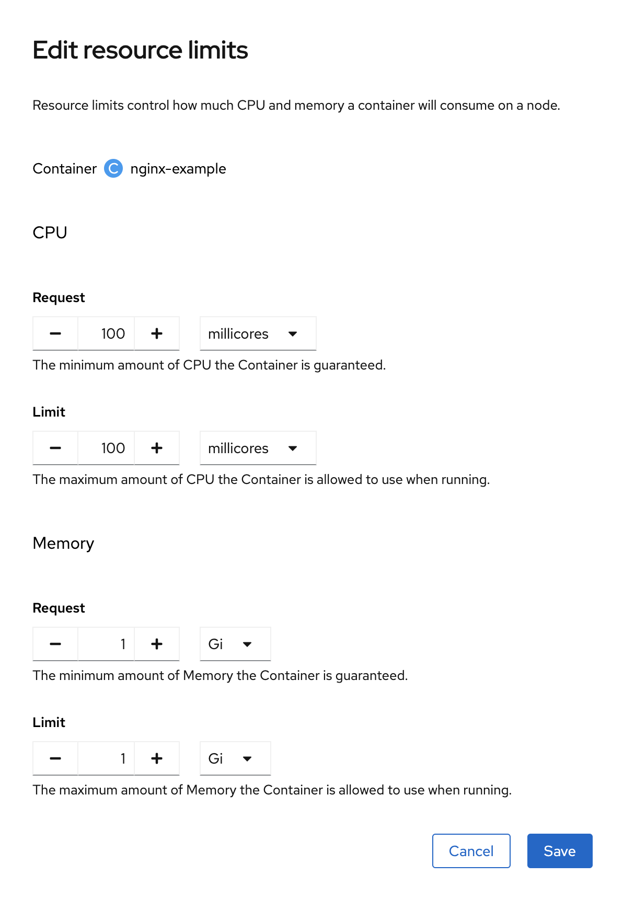

# OpenShift ClusterAutoScaler demo

## Description

This demo illustrate cluster Autoscaling feature and how an OpenShift cluster can scale the woker node number depending capacities requested by applications.

## How to demonstrate

1. Create ClusterAutoscalers object

```
apiVersion: autoscaling.openshift.io/v1
kind: ClusterAutoscaler
metadata:
  name: default
spec:
  podPriorityThreshold: -10
  resourceLimits:
    cores:
      max: 128
      min: 20
    maxNodesTotal: 12
    memory:
      max: 256
      min: 30
  scaleDown:
    delayAfterAdd: 1m
    delayAfterDelete: 1m
    delayAfterFailure: 30s
    enabled: true
    unneededTime: 60s
```

2. Create MachineAutoscalers object

```
apiVersion: autoscaling.openshift.io/v1beta1
kind: MachineAutoscaler
metadata:
  name: ocp02-2pntg-worker
  namespace: openshift-machine-api
spec:
  maxReplicas: 12
  minReplicas: 3
  scaleTargetRef:
    apiVersion: machine.openshift.io/v1beta1
    kind: MachineSet
    name: ocp02-2pntg-worker
status:
  lastTargetRef:
    apiVersion: machine.openshift.io/v1beta1
    kind: MachineSet
    name: ocp02-2pntg-worker
```

3. Create new project with NGINX UBI image
```
oc new-project nginx
oc new-app nginx -p NGINX_VERSION=1.20-ubi8
```

4. Change limites




5. Check nodes creation to provide needed capacities


