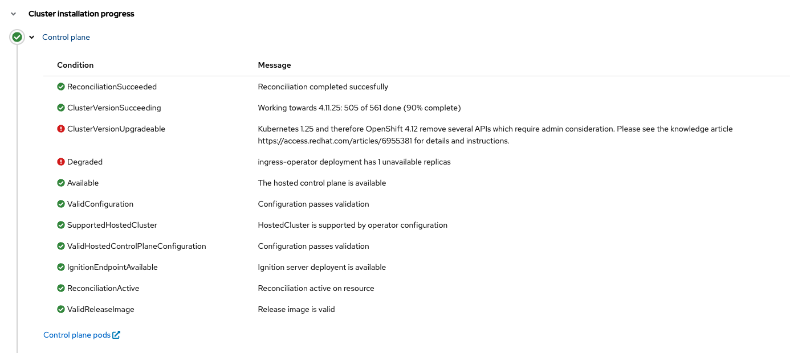
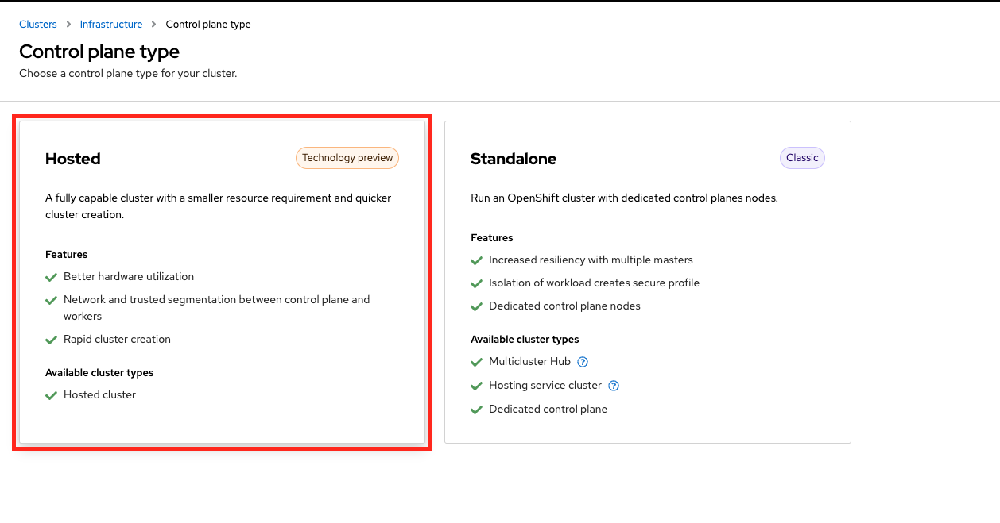
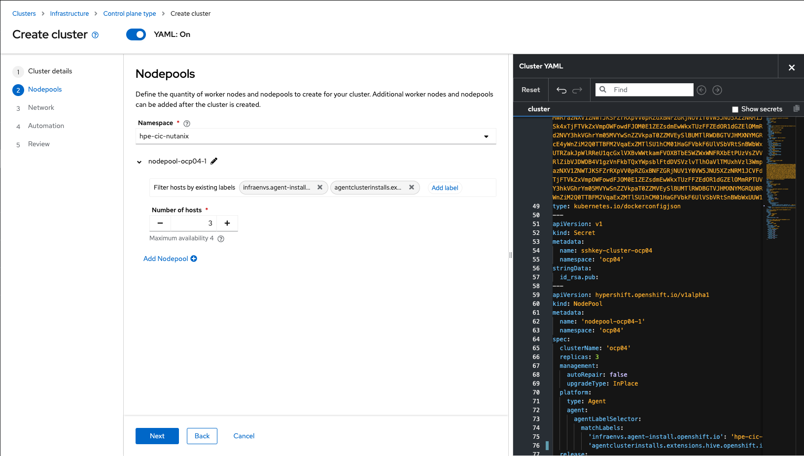
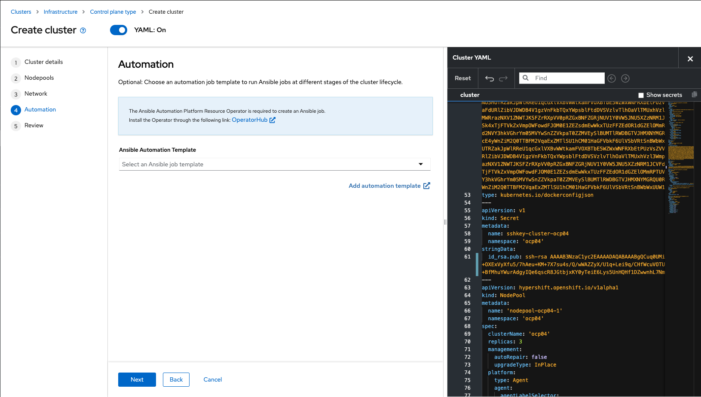
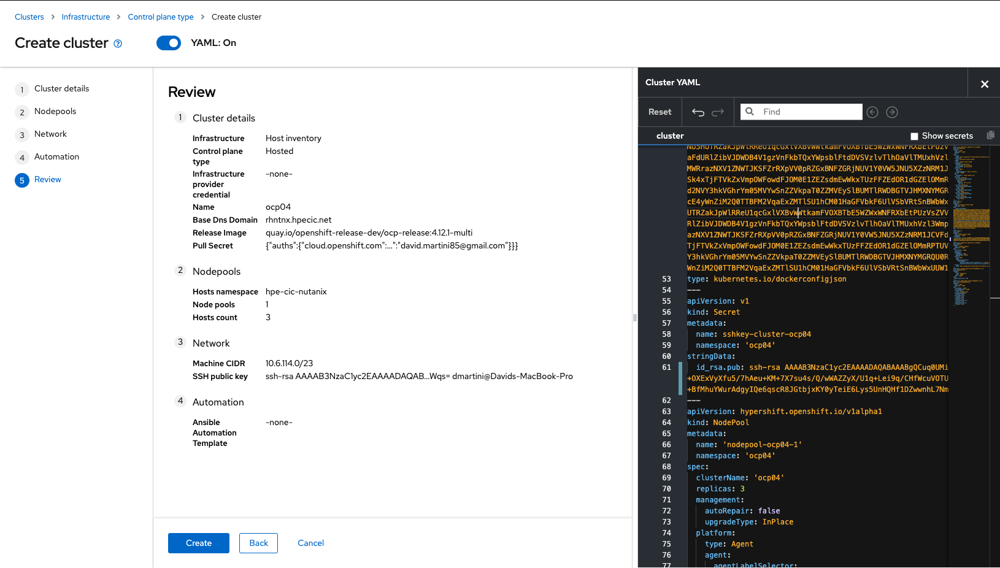
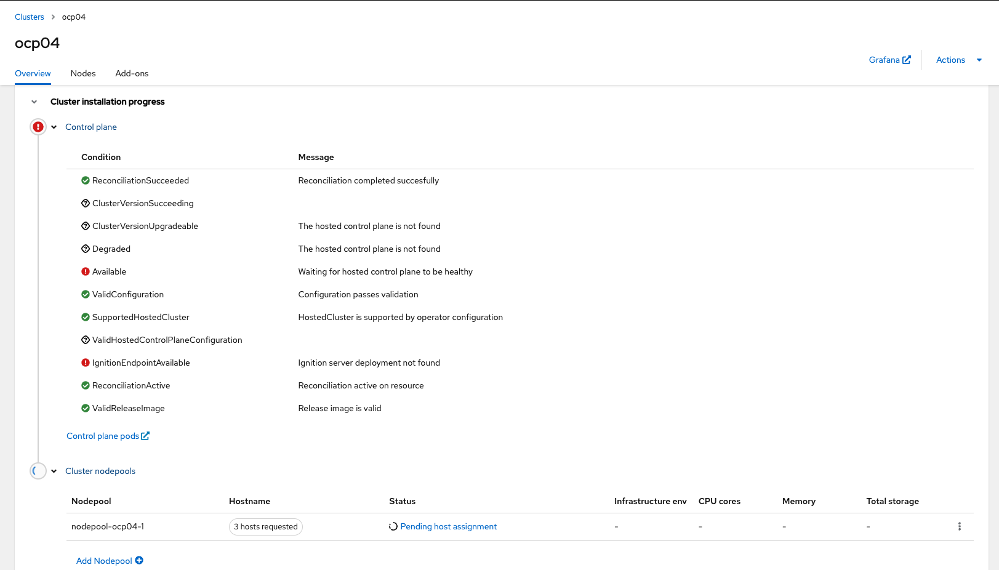

# Hypershift

## Doc

- https://hypershift-docs.netlify.app/how-to/kubevirt/create-kubevirt-cluster/


## Prerequisits

* HUB Cluster with ACM
* install agent with discovery image

## Deploy Hypershift add-on with ACM

1. Enable hypershift add-on

```
oc patch mce multiclusterengine --type=merge -p '{"spec":{"overrides":{"components":[{"name":"hypershift-preview","enabled": true}]}}}'
```

2. Install Hypershift add-on where local-cluster is your ACM cluster

```
apiVersion: addon.open-cluster-management.io/v1alpha1
kind: ManagedClusterAddOn
metadata:
  name: hypershift-addon
  namespace: local-cluster
spec:
  installNamespace: open-cluster-management-agent-addon
```

3. Check if hypershift add-on is running

```
oc get managedclusteraddons -n local-cluster hypershift-addon
```

## Create Hosted cluster with Hypershift in ACM

### 1. Create VM manually with agent discovery image and boot on it

  

 

 


### 2. Created VM are automatically integrated in ACM's hosts inventory via agent discovery image


### 3. Aprove discovered host


### 4. Update VMs to eject CDROM to boot on disk next reboot



### 5. Create Hosted cluster via ACM WebUI












### 6. Check Hosted cluster deployment 



