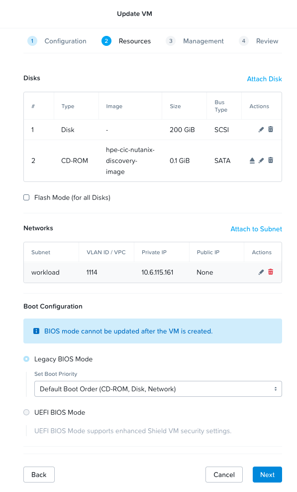
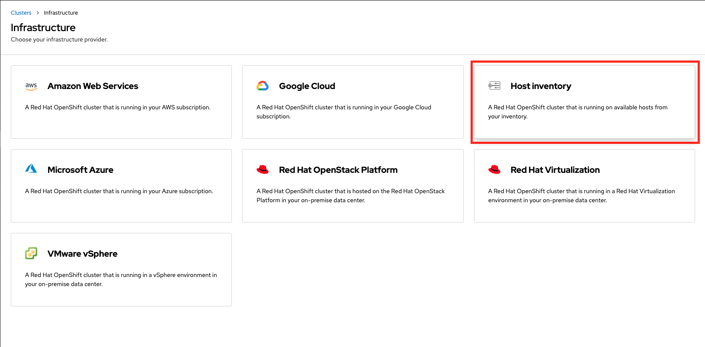
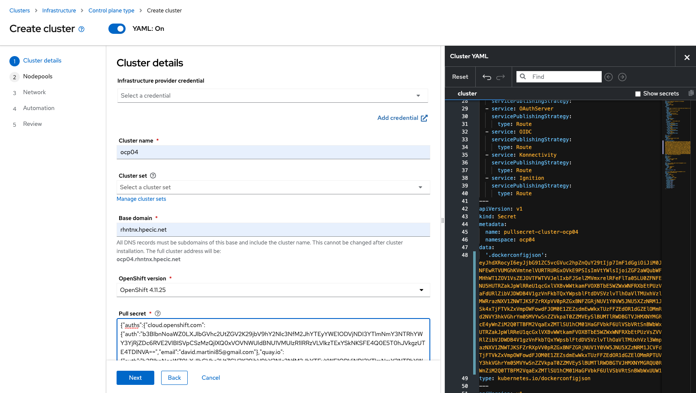
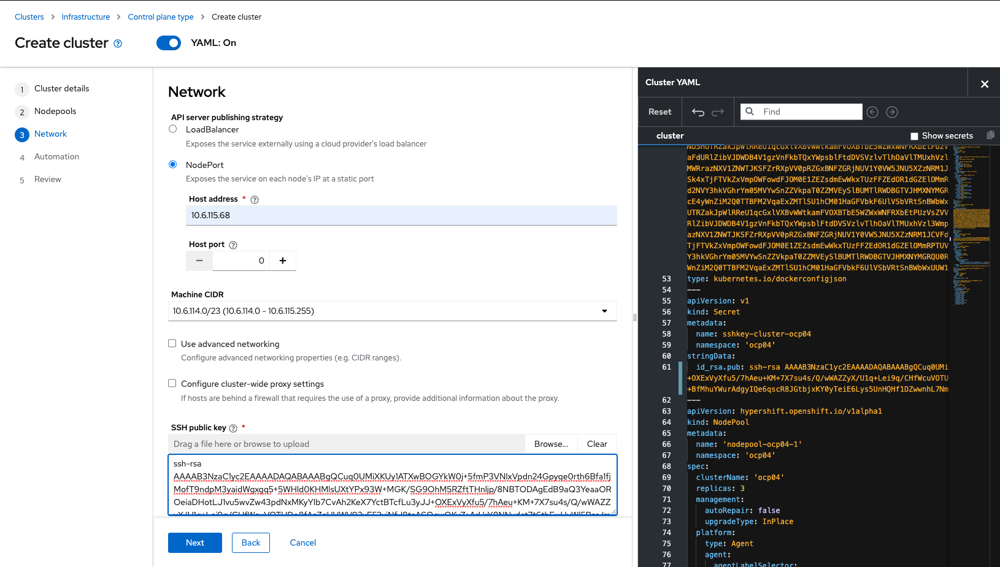
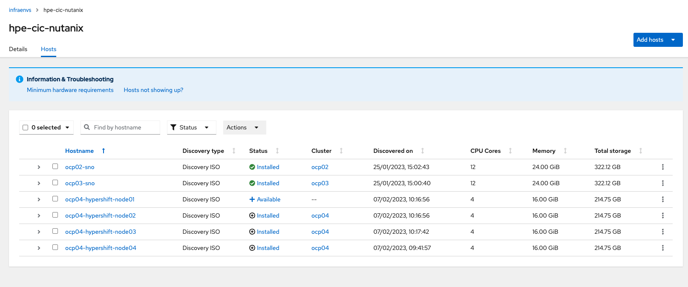
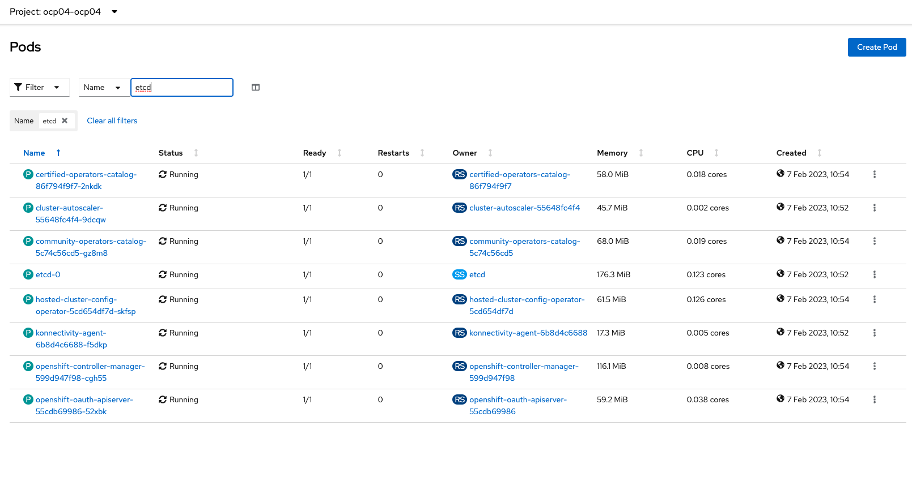
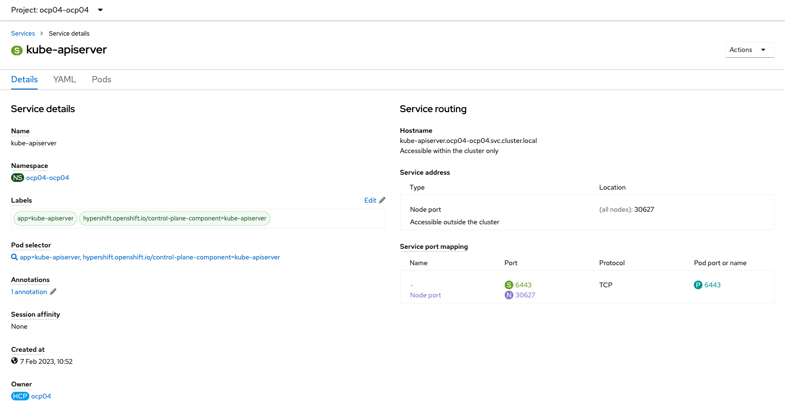

# Hypershift

## Doc

- https://hypershift-docs.netlify.app/how-to/kubevirt/create-kubevirt-cluster/


## Prerequisits

* HUB Cluster with ACM
* install agent with discovery image

## Deploy Hypershift add-on with ACM

1. Enable hypershift add-on

```
oc patch mce multiclusterengine --type=merge -p '{"spec":{"overrides":{"components":[{"name":"hypershift-preview","enabled": true}]}}}'
```

2. Install Hypershift add-on where local-cluster is your ACM cluster

```
apiVersion: addon.open-cluster-management.io/v1alpha1
kind: ManagedClusterAddOn
metadata:
  name: hypershift-addon
  namespace: local-cluster
spec:
  installNamespace: open-cluster-management-agent-addon
```

3. Check if hypershift add-on is running

```
oc get managedclusteraddons -n local-cluster hypershift-addon
```

## Create Hosted cluster with Hypershift in ACM

### 1. Create VM manually with agent discovery image and boot on it

  

 

 


### 2. Created VM are automatically integrated in ACM's hosts inventory via agent discovery image


### 3. Aprove discovered host


### 4. Update VMs to eject CDROM to boot on disk next reboot


### 5. Create Hosted cluster via ACM WebUI











### 6. Check Hosted cluster deployment 





## Enable HA for deployed hosted cluster

When you deploy Hosted OpenShift cluster with ACM, control plane is deployed with no HA (1 pod for ETC and OVN for example)



To have High Availability on the control plane, we have to modify **HostedCluster** object to replace **SingleReplica** by **HighlyAvailable**

```
apiVersion: hypershift.openshift.io/v1alpha1
kind: HostedCluster
metadata:
  name: ocp04
  namespace: ocp04
spec:
  fips: false
  release:
    image: 'quay.io/openshift-release-dev/ocp-release:4.11.25-x86_64'
  dns:
    baseDomain: rhntnx.hpecic.net
  controllerAvailabilityPolicy: **SingleReplica**
  infraID: ocp04
  etcd:
    managed:
      storage:
        persistentVolume:
          size: 4Gi
        type: PersistentVolume
    managementType: Managed
  infrastructureAvailabilityPolicy: **SingleReplica**
  platform:
    agent:
      agentNamespace: hpe-cic-nutanix
    type: Agent
    ...
```

```
apiVersion: hypershift.openshift.io/v1alpha1
kind: HostedCluster
metadata:
  name: ocp04
  namespace: ocp04
spec:
  fips: false
  release:
    image: 'quay.io/openshift-release-dev/ocp-release:4.11.25-x86_64'
  dns:
    baseDomain: rhntnx.hpecic.net
  controllerAvailabilityPolicy: **HighlyAvailable**
  infraID: ocp04
  etcd:
    managed:
      storage:
        persistentVolume:
          size: 4Gi
        type: PersistentVolume
    managementType: Managed
  infrastructureAvailabilityPolicy: **HighlyAvailable**
  platform:
    agent:
      agentNamespace: hpe-cic-nutanix
    type: Agent
    ...
```

We have now 3 replicats of critical parts to provide High Availability on hosted control plane


## Network part

**ocp04** Hosted cluster deployed via ACM have this network configuration

| What | Where hosted | accessible via |
| ---- | ------------ | --------------- |
| **ocp04** control plane | **ocp04-ocp04** namespace in ACM cluster where control plane pods are created | node port & routes on ACM cluster |
| **ocp04** data plane | on VMs created with agent and discovery image | routes |



### HA Proxy config

HA Proxy config for LB where Control plane API backend corresponding to **node port** created on ACM clusternodes. Ingress backend corresponding to VMs and who host ingress component. 

```
...
#---------------------------------------------------------------------
# main frontend which proxys to the backends
#---------------------------------------------------------------------

frontend api
    bind 10.6.112.10:6443
    default_backend controlplaneapi

frontend secure
    bind 10.6.112.10:443
    default_backend secure

frontend insecure
    bind 10.6.112.10:80
    default_backend insecure

#---------------------------------------------------------------------
# static backend
#---------------------------------------------------------------------

backend controlplaneapi
    balance source
    server master0 10.6.115.68:30627 check
    server master1 10.6.115.171:30627 check
    server master2 10.6.115.20:30627 check

backend secure
    balance source
    server worker0 10.6.115.145:443 check
    server worker1 10.6.115.161:443 check
    server worker2 10.6.115.57:443 check

backend insecure
    balance source
    server worker0 10.6.115.145:80 check
    server worker1 10.6.115.161:80 check
    server worker2 10.6.115.57:80 check
```

## Extend cluster with new node

You can extend the hosted cluset's capacities by adding new discovered node (VM) with agent discovvery image.


